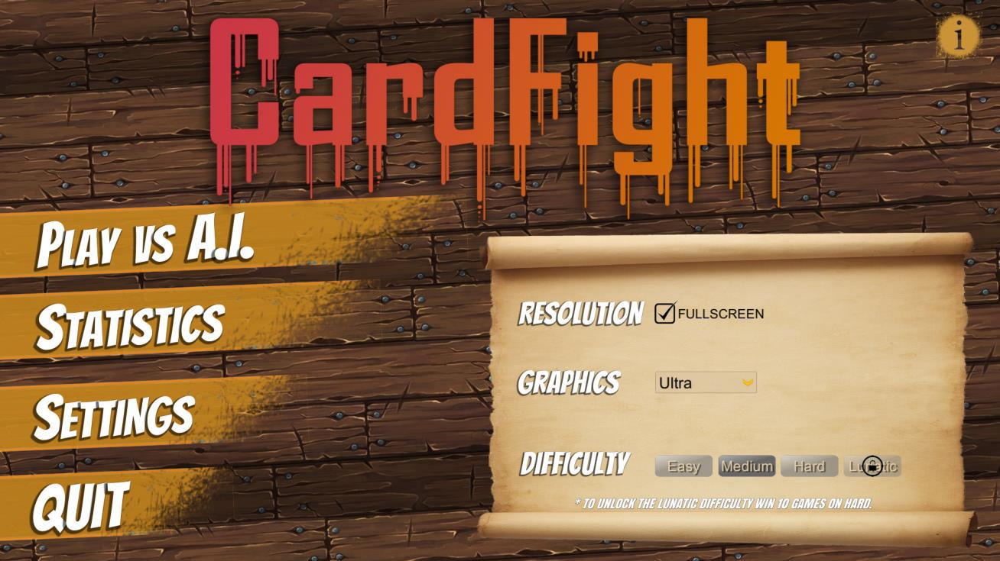
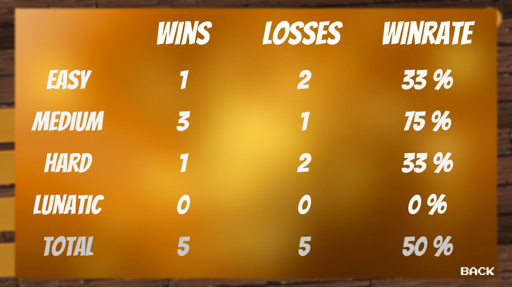
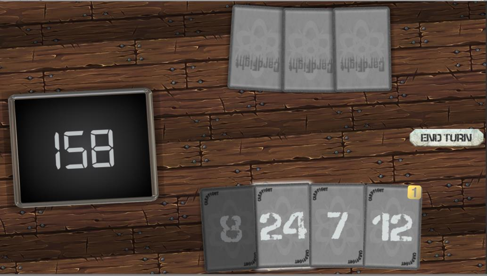

# **Game "CardFight"**
---
## Game Description
- **Dynamic Initial State:** Each game starts with an initial state, where random cards with numbers are provided.
- **Choose Your Challenge:** Players get to choose their difficulty level and start playing the game using the available cards which vary depending on their selected level.
- **Strategic Gameplay:** With each turn, you'll carefully strategize and select a card to manipulate the numbers displayed on the screen.
- **AI Opponent:** The computer will play against the player using an algorithm for optimal moves.
- **Victory Condition:** The game aims to trick your opponent into making the number on the display negative.

## Installation and Start
- **Installation:** Download and install the Setup.exe file.
- **Start:** Launch the game by running the CardFight.exe file.
---
## **Conclusion**
"CardFight" isn't merely a game - it's a testament to your strategic prowess and tactical cunning. Are you ready to seize the challenge, outsmart your opponents, and emerge triumphant? Step into the arena, sharpen your mind, and prepare to conquer the battlefield of numbers!

    
    
    

